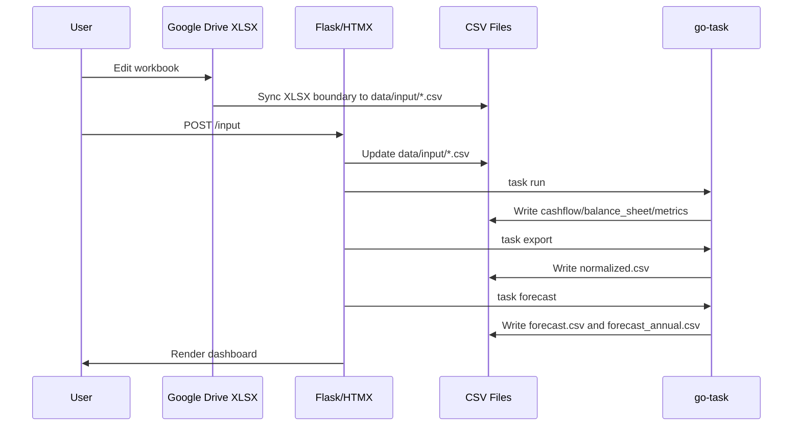

# System Architecture

## Data Flow Pipeline

## Boundaries

- `src/infrastructure/web.py`: Flask + HTMX routes, CSV updates, task triggers.
- `Taskfile.yml`: `run`, `export`, `forecast`.
- `scripts/forecast.py`: `normalized.csv` + `master/forecast_streams.csv` → forecast CSVs.
- `data/input/`: source CSVs.
- `data/calculated/`: generated CSVs.
- `master/`: account, asset, payment, forecast stream metadata.
