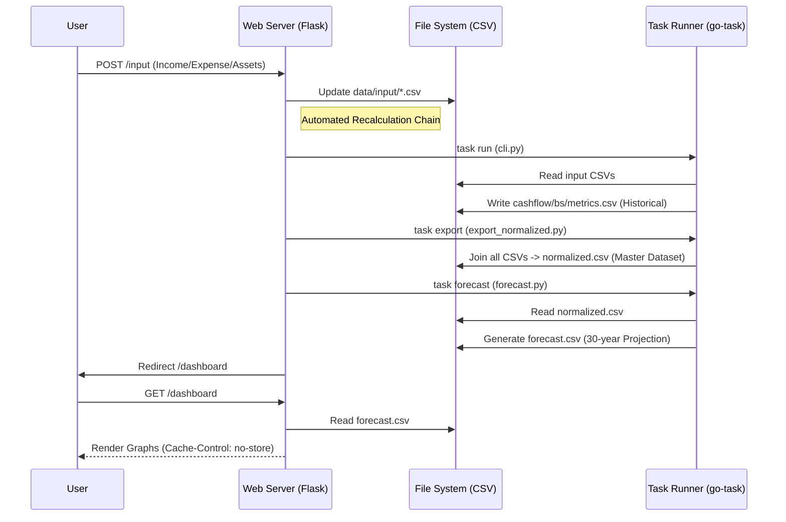

# System Architecture

## Data Flow Pipeline

The system follows a strict Unidirectional Data Flow for financial data processing.

## Components

### 1. Web Server (`src/infrastructure/web.py`)
- **Role**: Interface for data visualization and input.
- **Tech**: Flask + HTMX.
- **Key Features**:
  - **Dynamic Input**: Generates input suggestions based on moving averages (6m, 1y, 5y).
  - **Task Orchestration**: Triggers standard `task` commands for recalculation.
  - **Cache Control**: Enforces fresh data delivery via HTTP headers.

### 2. Task Runner (`Taskfile.yml`)
- **Role**: Single source of truth for command execution.
- **Key Tasks**:
  - `task run`: Calculates historical financial statements.
  - `task export`: Normalizes and merges all data into a single consumption layer.
  - **task forecast**: Runs the 30-year simulation engine.

### 3. Simulation Engine (`scripts/forecast.py`)
- **Role**: Predicts future asset values.
- **Logic**:
  - Starts from the current system month (dynamic).
  - Uses statistical trends from historical data (no manual parameter tuning).

### 4. Data Layer (`data/`)
- **Input**: Raw CSVs edited by the user or web app.
- **Calculated**: Derived CSVs generated by the pipeline.
- **Master**: Statutory definitions (Accounts, Asset Classes).
